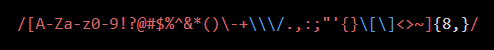
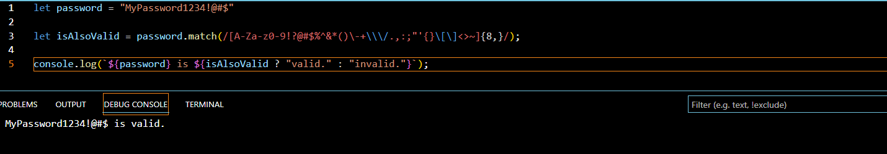

# Title RegEx Password Validation

Introductory paragraph (replace this with your text)

## Summary

Regular Expressions! You many not know them; you may not love them, but what are they? In JavaScript (including many other language and programs such as Microsoft Excel), are pattern seeking expressions used to match character combinations in strings. There are many use cases for these awesome expressions; however, there are three general uses. Uses include validation, extraction, and replacement. In this short tutorial, we will cover a common implementation of regular expressions: password validation! Our expression is as follows.

Now, let’s breakdown some of the concepts applied to our regular expression (regex). 

## Table of Contents

- [Ranges](#ranges)
- [Quantifiers](#quantifiers)
- [Bracket Expressions](#bracket-expressions)

## Regex Components

### Ranges
In our expression, we make good use of alphabetic and numeric range shorthand.

* 0-9: match any number from 0 to 9. Instead of writing 0123456789 the shorthand version is [0-9]
* A-Z: match all capitalized letters from “A” to “Z”
* a-z: match all lowercase letters from “a” to “z”

### Bracket Expressions
In our example, we are making heavy use of bracket expressions “[ ]”. Here, we are collating symbols and ranged expressions. 

* [A-Za-z0-9!?@#$%^&*()\-+\\\ /.,:;"'{}\[\]<>~] this expression can be broken down into various parts, but essentially states: match all upper/lower case letters, numbers form 0 to 9, and special characters. 

Notice the use of backslashes in our expression ( \[\] ). Backslash can be used to escape characters much like we do in JavaScript. Here, we are escaping the brackets to prevent JavaScript from treating it as a new bracket expression. 

### Quantifiers
Quantifiers indicate the number of characters to match. In our password validator, we quantify and set a minimum number of letters, numbers, and special characters required for the password to be valid. 

* {8,} - Matches at least "8" occurrences of the preceding item (numbers, letters, and special characters)

## Put It All Together
When we apply these tools within an expression, we can create a bit of logic such as this: a passing attempt at our password validator. 

I encourage you to investigate the massive volumes of regex resources and give it a shot yourself! 

## Author

Hey there, I’m Matt Teixeira; a full-stack web developer. Currently, I work in the environmental consulting field as a scientist and data analyst. In my offtime, I enjoy leveraging my background experiances to develop web applications that are both fun and/or usefull tools. 
Check out my [repositories](https://github.com/ApolloSolo)